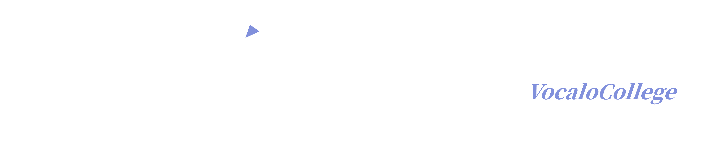
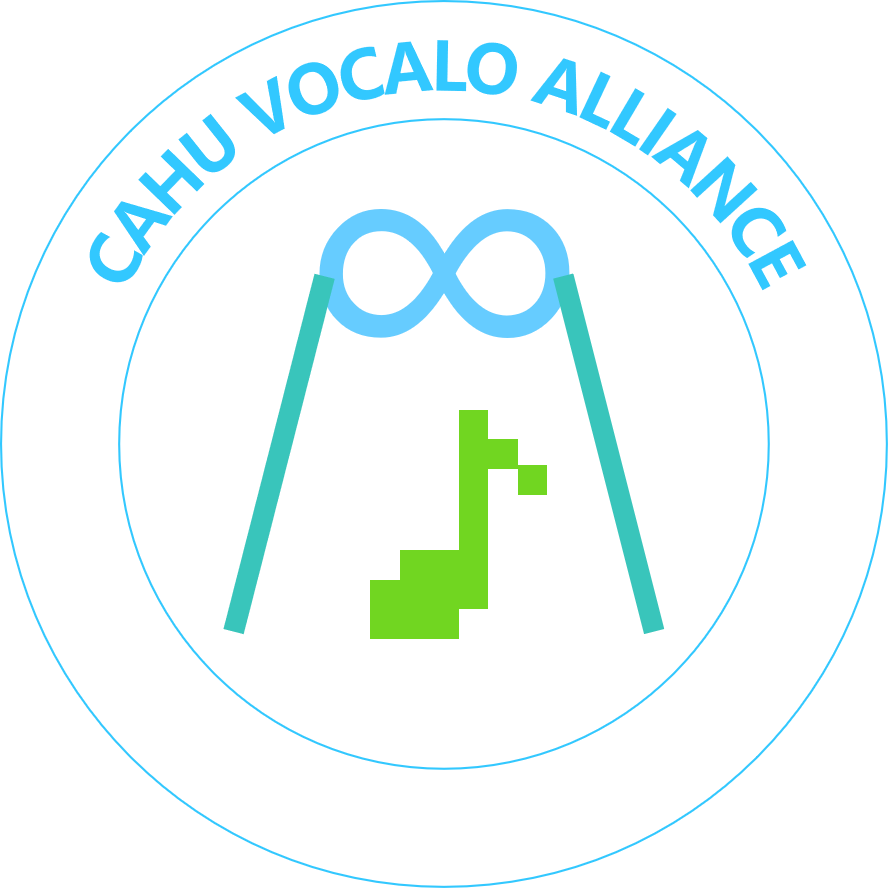

# VOCALOCOLLEGE  README
## HexClear233

                
                

# 栏目简述

**高校术力口之声**是一个专注收录和展示高校社团发布的术力口音乐相关作品的非营利性同好交流视频栏目，旨在展现高校的术力口活力，展现术力口的高校力量。
致力于收集、整理和展示高校内部与术力口相关的各种视频内容，包括但不限于音乐视频、舞蹈视频、翻唱视频等。
通过这个栏目，希望能够促进术力口文化的发展，增强社区成员之间的互动与交流，同时也为更多人了解和喜爱术力口提供便利。

# 栏目说明

本栏目仅作为高校术力口作品的汇总，选取与展示，和一定程度上的作品推荐。本栏目旨在同好交流与作品推介，非官方排名，请保持客观理性的讨论氛围。

1. 视频内所引用的音视频素材均来自 Bilibili 原作者。本视频仅作非营利性交流与推荐，如有侵权请私信处理。
2. 受限于观测视野及栏目篇幅，难免存在社团作品遗漏，所展示作品不代表该社团的全部实力。
3. 本栏目包含强烈的策展人审美倾向，入选、排序及点评仅代表个人观点，非权威排名。
4. 各模块的展示顺序并非代表其质量或流量好坏，仅为个人主观设计排序。

# 收录范围说明

考虑到高校社团内，术力口相关浓度和创作主要集中在动漫社团、音乐社团、Vocaloid社团等相关类型的社团内，我们的收录范围主要聚焦于这些类型的社团内发布的术力口相关作品。

栏目现在收录的高校社团，主要为各个高校的动漫社，动漫协会或者歌声合成，音声合成相关社团。

栏目现在主要调查社团在哔哩哔哩（bilibili.com）上的相关账号和发布的术力口相关作品，收录范围也主要聚焦于这些账号发布的术力口相关作品。

社团账号收录范围：
1. 该社团在哔哩哔哩（bilibili.com）可以查找得到其官方账号。在资料模糊或无法查阅，并且其能力和作品质量优秀的情况下，适当考虑其相关账号，或者其他平台的账号。 
2. 关于所收录和展示的作品，要求在哔哩哔哩可查找到视频，其由上述的哔哩哔哩社团账号作为UP主，或者有其社团账号参与联合投稿。 
3. 单社团收录上限：1（常态情形）+ 1（最推荐情形）。 
4. 收录范围包括与术力口相关的原创作品，翻调作品，人声翻唱，乐器翻奏，衍生创作等。详见相关符号描述。 

收录社团列表：社团列表

# 相关符号说明

在新版栏目视频中，每个作品稿件会有类似[XX]的形式用于指明其类别。以下是类别符号的具体指明：

`[OC]` Original Content / 原创作品 
拥有独立词、曲、编、调体系的完整虚拟歌手原创曲或全原创作品产出。 （全原创的其他作品，比如全原创语调教算入其中） 
`[RT]` Re-Tuning / 翻调作品 
使用术力口声库对既有曲目进行重新调教、填词或编曲。 
`[VC]` Vocal Cover / 人声翻唱 
由高校个人歌手或社团进行的真人人声演绎。 （带主唱的乐队演出算入其中） 
`[IC]` Instrumental Cover / 乐器翻奏 
涵盖乐队演奏、民乐适配及各类器乐改编。 （不带主唱的乐队演出和仅乐器演出算入其中） 
`[DW]` Derivative Works / 衍生创作 
包括宅舞（Dance）、MMD、打艺（Wota Gei）及视觉重制等。 
与此同时，考虑到其他企划相关创作在术力口创作当中的比重，以[XX/YYYY]代指相关创作。 
比如，世界计划（Project Sekai）相关创作，以[XX/PJSK]代指相关创作。 当前，仅考虑世界计划企划作为其他企划。 

# 栏目视频结构

大体上，每一期栏目视频分为以下结构：

1. Intro（包含栏目介绍等内容） 
2. 原创作品切片展示 [OC] 
3. 翻调作品切片展示 [RT] 
4. 人声翻唱切片展示 [VC] 
5. 快闪展示（包含[DW]，以及[OC] [RT] [VC]中前三部分未展示，同时并非为最推荐的作品） 
6. 最推荐作品展示（SP Case），具体见相关说明。 
7. 结尾（包含收录范围说明等内容） 

# 关于最推荐作品（SP Case）

最推荐作品（SP Case）是当期视频中，策展人根据当期收录的作品情况，选取的最推荐的作品进行重点展示的环节。每一期仅有一个最推荐作品。选取的标准主要基于策展人主观审美和对作品的理解。 
最推荐作品（SP Case）在栏目视频中会有更长的展示时间，并作为直至该期视频结束的BGM。 
需要注意的是，最推荐作品（SP Case）的选取具有较强的主观性，并不代表权威排名，仅供参考和交流讨论。 

最推荐作品在满足收录范围的同时，其作品类别必须为原创作品（[OC]），或者翻调作品（[RT]）。 
同时，在SP Case之前的展示内容中，最推荐作品不会出现。 

另外，除非质量形成断崖式领先，否则不可能连续三期最推荐作品隶属同一社团。

# 联系栏目

目前，本栏目由我自己独立经营。欢迎对栏目有任何意见和建议，或者想要推荐社团，作品的同好联系栏目。 
联系方式： 
B站：<a href="https://space.bilibili.com/1238483602?spm_id_from=..0.0" target="_blank">UP主 个人主页</a> 
邮箱：<a href="mailto:vocalocollege@163.com">vocalocollege@163.com</a> 

